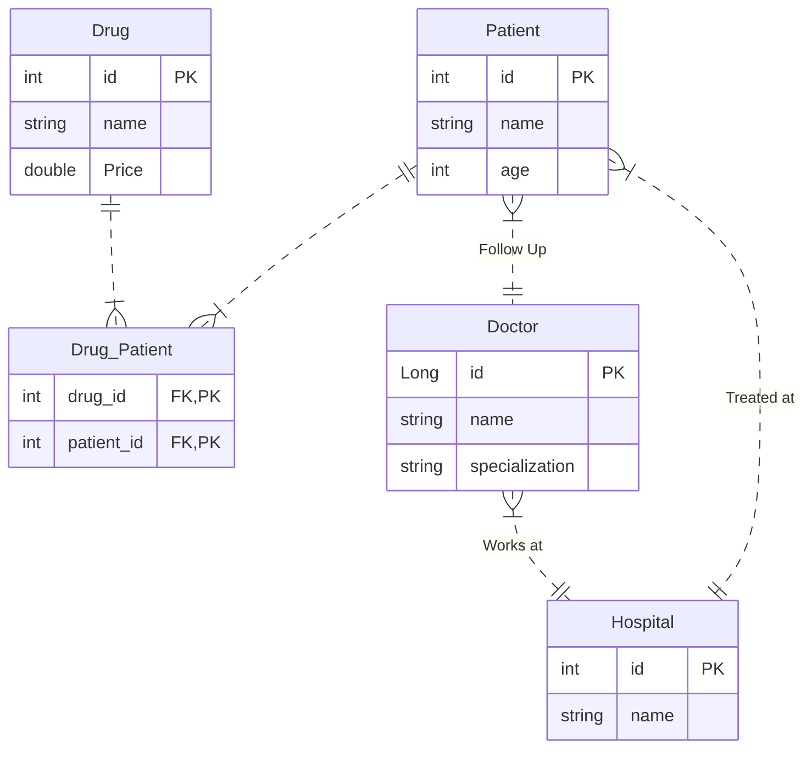

# JDBC & ORM

## Resources

- Eng/ Ali Session **[Part 1](https://drive.google.com/file/d/1yrbLZWqGi5ZCHNbxbW387a4sgzg_8FQF/view?usp=drive_link)** & **[Part 2](https://drive.google.com/file/d/1WMmyO5ly-4i9OfgGSzH7s5UQKX_oOi4M/view?usp=sharing)** & **[Slides & Sample Code](https://drive.google.com/file/d/1CeKeeDCvSbMc8H6W5PLoZuoCEXBJaqOK/view?usp=drive_link)**

## Tasks
- Pratice on JDBC & ORM (JPA-Hibernate), and implement the following task using both of them.

- Map the following schema to Java Entities and apply the following operations using JPA-Hibernate:
   - Get all doctors name that works in a given hospital.
   - Get all patients name that follow up with a given doctor.
   - Get all drugs name that a specific doctor write (To all patients).

> [!NOTE]
> I implemented the above task using Hibernate only, but you will find some practice with JDBC & JPA for the sake of practice.
